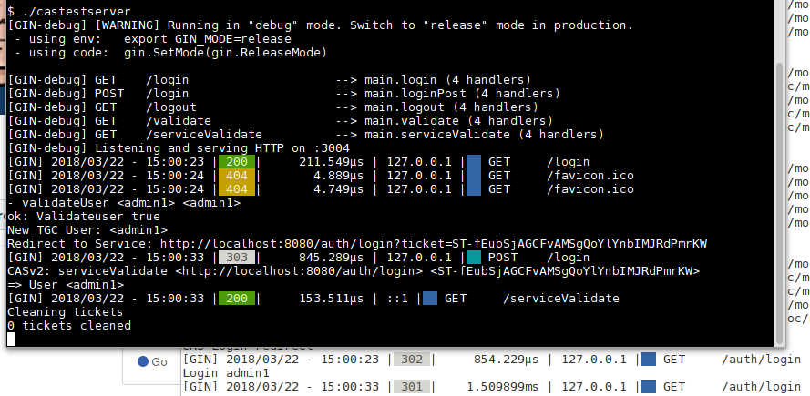

# castestserver
A Jasig CAS server for auth tests


## Description

An autonomous and multi-plateform minimalist Jasig CAS server to allow local authentication tests.

With default "test" backend, all users with **same login and password** are validated.

Now support CASv1 (``/validate``) and CASv2 (``/serviceValidate``). Proxy tickets and user attributes (CASv3) will coming later.


## Usage

```bash
$ ./castestserver -h
Usage of ./castestserver:
  -backend string
    	user validate : [test|ldap] (default "test")
  -basepath string
    	basepath
  -conf string
    	Optional INI config file
  -debug
    	Debug, doesn't log to file
  -port string
    	CAS listening port (default "3004")
```





## Advanced usage

Ldap backend, log rotate and rate limiter allow usage of castestserver for small business, behind any https proxy.

```bash
$ cat confsample.ini
Secret=0123456789123456
HashSecret=very-secret
LdapServer=ldap-server.example.org
LdapBind=ou=people,dc=example,dc=org
LogPath=./log.log


$ ./castestserver -conf confsample.ini -backend ldap &


```

## Useful links

* [CAS Protocol Specification](https://apereo.github.io/cas/5.0.x/protocol/CAS-Protocol-Specification.html)
* [Simple CAS server with ldap binding](https://github.com/jmcarbo/golacas)
* [WIP golang CAS server](https://github.com/apognu/gocas)


## Build


```bash

# Add go-bindata to embedded html template
$ go get -u github.com/jteeuwen/go-bindata/...

$ ${GOPATH}/bin/go-bindata -o myweb.go tmpl/

# Build Linux 64
$ GOOS=linux GOARCH=amd64 go build -ldflags "-s" -o castestserver

# Build Windows 32
$ GOOS=windows GOARCH=386 go build  -ldflags "-s" -o castestserver32.exe

# Build MacOs 64
$ GOOS=darwin GOARCH=amd64 go build  -ldflags "-s" -o castestserverOsX

```


## Licence

MIT License

Copyright (c) 2020 Yves Agostini

<yves+github@yvesago.net>
